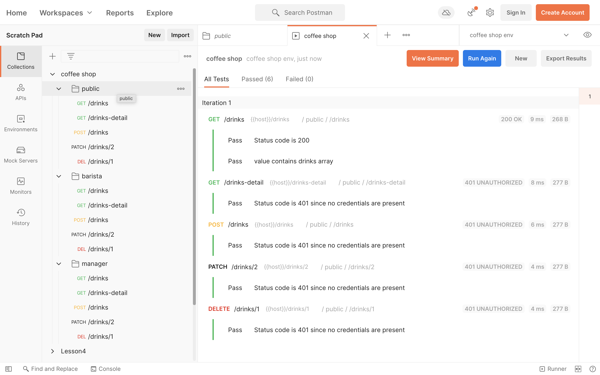
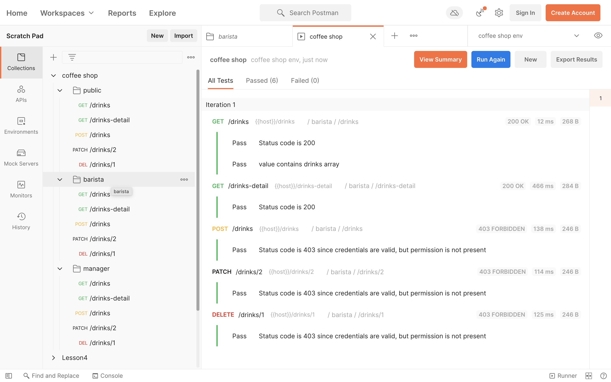
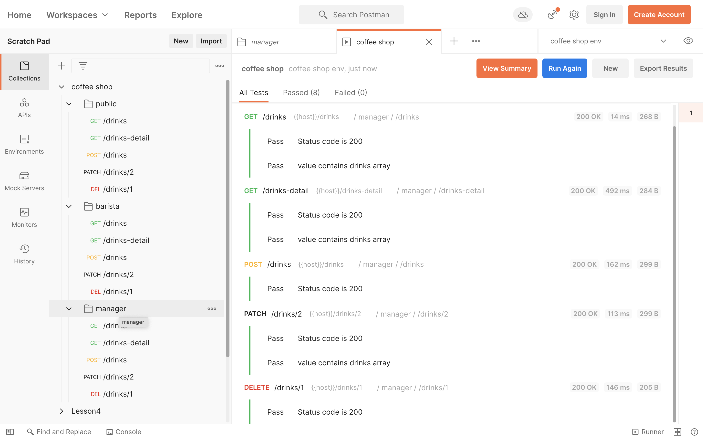

# Identity and Access Management for the Coffee Shop App

## Overview
In this project, I built the backend for a coffee shop application. I added user accounts and authentication to the application and used role-based access management strategies to control different types of user behavior in the app. The application can:

- Display graphics representing the ratio of ingredients in each drink.
- Allow public users to view drink names and graphics.
- Allow the shop baristas to see the recipe information.
- Allow the shop managers to create new drinks and edit existing
drinks.

## Tech Stack (Dependencies)
### Backend
The `./backend` directory contains a Flask server with the following dependencies:

- Python 3.7: Follow instructions to install the latest version of python for your platform in the [python docs](https://docs.python.org/3/using/unix.html#getting-and-installing-the-latest-version-of-python)

- Virtual Environment: I recommend working within a virtual environment whenever using Python for projects. This keeps your dependencies for each project separate and organized. Instructions for setting up a virtual environment for your platform can be found in the [python docs](https://packaging.python.org/guides/installing-using-pip-and-virtual-environments/)

- PIP Dependencies: Once you have your virtual environment setup and running, install dependencies by naviging to the `/backend` directory and running:

    ```bash
    pip install -r requirements.txt
    ```

- Other Dependencies
    - [Flask](http://flask.pocoo.org/) is a lightweight backend microservices framework. Flask is required to handle requests and responses.

    - [SQLAlchemy](https://www.sqlalchemy.org/) and [Flask-SQLAlchemy](https://flask-sqlalchemy.palletsprojects.com/en/2.x/) are libraries to handle the lightweight sqlite database. 

    - [jose](https://python-jose.readthedocs.io/en/latest/) JavaScript Object Signing and Encryption for JWTs. Useful for encoding, decoding, and verifying JWTS.

### Frontend
The `./frontend` directory contains a Ionic frontend with the following dependencies:

- Node and NPM: This project depends on Nodejs and Node Package Manager (NPM). Before continuing, you must download and install Node (the download includes NPM) from [https://nodejs.com/en/download](https://nodejs.org/en/download/).

- Ionic Cli: The Ionic Command Line Interface is required to serve and build the frontend. Instructions for installing the CLI is in the [Ionic Framework Docs](https://ionicframework.com/docs/installation/cli).

- Other dependencies: This project uses NPM to manage software dependencies. NPM Relies on the package.json file located in the `frontend` directory of this repository. After cloning, open your terminal and run:

    ```bash
    npm install
    ```

## Getting Started
### Backend
From within the `./src` directory first ensure you are working using your created virtual environment. Each time you open a new terminal session, run:

```bash
export FLASK_APP=api.py
cd backend/src
flask run --reload
```
### Setup Auth0
1. Create a new Auth0 Account
2. Select a unique tenant domain
3. Create a new, single page web application
4. Create a new API
   - in API Settings:
     - Enable RBAC
     - Enable Add Permissions in the Access Token
5. Create new API permissions:
   - `get:drinks-detail`
   - `post:drinks`
   - `patch:drinks`
   - `delete:drinks`
6. Create new roles for:
   - Barista
     - can `get:drinks-detail`
   - Manager
     - can perform all actions
7. Test your endpoints with [Postman](https://getpostman.com).
   - Register 2 users - assign the Barista role to one and Manager role to the other.
   - Sign into each account and make note of the JWT.
   - Import the postman collection `./backend/coffee_shop.postman_collection.json`
   - Right-clicking the collection folder for barista and manager, navigate to the authorization tab, and including the JWT in the token field. Then run the tests.

      
      
      
### Frontend
- Configure Environment Variables: Ionic uses a configuration file to manage environment variables. These variables ship with the transpiled software and should not include secrets. Open `./src/environments/environments.ts` and ensure each variable reflects the system you stood up for the backend.

- Running Your Frontend in Dev Mode: Ionic ships with a useful development server which detects changes and transpiles as you work. The application is then accessible through the browser on a localhost port. To run the development server, cd into the `frontend` directory and run:

    ```bash
    ionic serve
    ```
- Authentication: The authentication system used for this project is Auth0. `./src/app/services/auth.service.ts` contains the logic to direct a user to the Auth0 login page, managing the JWT token upon successful callback, and handle setting and retrieving the token from the local store. This token is then consumed by our DrinkService (`./src/app/services/drinks.service.ts`) and passed as an Authorization header when making requests to our backend.

- Authorization: The Auth0 JWT includes claims for permissions based on the user's role within the Auth0 system. This project makes use of these claims using the `auth.can(permission)` method which checks if particular permissions exist within the JWT permissions claim of the currently logged in user. This method is defined in  `./src/app/services/auth.service.ts` and is then used to enable and disable buttons in `./src/app/pages/drink-menu/drink-form/drink-form.html`.